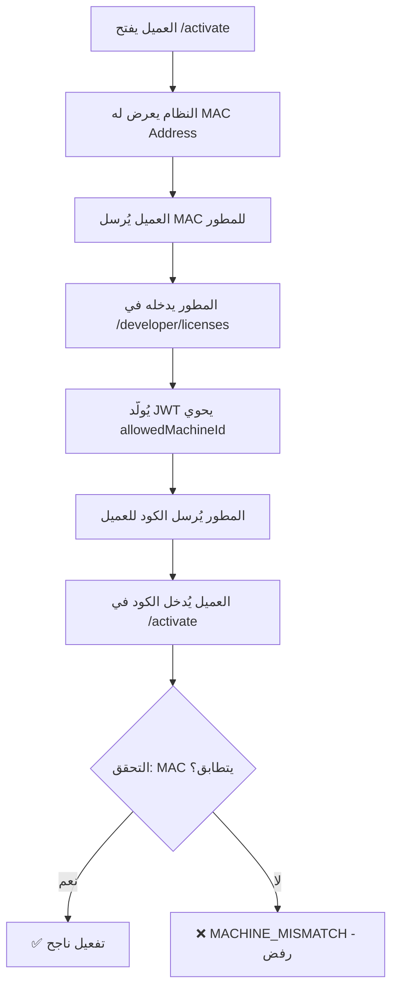

# Feature 015 — Hardware Binding Upgrade Plan
## ربط الترخيص ببصمة الجهاز (MAC Address Lock)

> **الهدف:** منع العميل من نسخ مفتاح الترخيص واستخدامه على أجهزة أخرى.

---

## 1. قراءة بصمة الجهاز — Backend Utility

### الملف الجديد: `lib/machineId.ts`

**الطريقة:** استخدام `os.networkInterfaces()` من Node.js المدمج (بدون مكتبات خارجية).

**المنطق:**
```typescript
import os from 'os';

export function getMachineId(): string {
    const nets = os.networkInterfaces();
    // اختر أول واجهة شبكة فعلية (ليست loopback) ذات MAC حقيقي
    for (const interfaces of Object.values(nets)) {
        for (const iface of interfaces ?? []) {
            if (!iface.internal && iface.mac && iface.mac !== '00:00:00:00:00:00') {
                return iface.mac.toLowerCase();
            }
        }
    }
    return 'unknown';
}
```

> **ملاحظة:** `os.networkInterfaces()` متاح في بيئة Node.js وليس في Edge Runtime — يجب استخدامه في API Routes العادية (`force-dynamic`) وليس داخل `middleware.ts`.

---

## 2. API جديد — `GET /api/license/machine-id`

- يستدعي `getMachineId()` ويُعيد MAC Address الجهاز.
- يُستدعى من شاشة التفعيل `/activate` لعرضه للعميل.

```json
// Response
{ "machineId": "aa:bb:cc:dd:ee:ff" }
```

---

## 3. تحديث شاشة التفعيل — `/activate`

### الإضافات على الواجهة:
- عند تحميل الصفحة: `useEffect` يجلب `/api/license/machine-id`
- يُعرض الـ MAC Address بخط `font-mono` داخل بطاقة مميزة
- زر "نسخ" لمساعدة العميل على إرساله للمطور

```
┌──────────────────────────────────────┐
│  بصمة جهازك (أرسلها للمطور)         │
│  [ aa:bb:cc:dd:ee:ff ]  📋 نسخ       │
└──────────────────────────────────────┘
```

---

## 4. تحديث لوحة المطور — `/developer/licenses`

### الإضافات على النموذج:
- حقل نصي جديد: **"بصمة الجهاز (Machine ID)"**
- لا يُشترط ملؤه (اختياري للتراخيص القديمة)، لكن يُنصح به للعملاء الجدد

---

## 5. تحديث API التوليد — `POST /api/developer/generate-license`

### تغيير في JWT Payload:
```typescript
// إضافة هذا الحقل:
allowedMachineId: machineId || null,  // null = غير مقيّد بجهاز معين
```

---

## 6. تحديث منطق التحقق — `activate` + `status` APIs

### خطوة إضافية في كلا الـ API:

```
1. استخراج allowedMachineId من JWT Payload
2. إذا كان allowedMachineId != null:
   a. استدعاء getMachineId() لقراءة MAC الجهاز الحالي
   b. مقارنة getMachineId() === allowedMachineId
   c. إذا لم يتطابقا → رفض + رسالة "هذا الترخيص غير متوافق مع هذا الجهاز"
3. إذا allowedMachineId == null → قبول على أي جهاز (للتراخيص المفتوحة)
```

**رمز الخطأ المُعاد:** `MACHINE_MISMATCH` + HTTP 400

---

## 7. تدفق العمل الكامل (العميل + المطور)



---

## 8. الملفات التي ستُعدَّل أو تُنشأ

| الملف | نوع التغيير |
|-------|-------------|
| `lib/machineId.ts` | **[جديد]** دالة استخراج MAC |
| `app/api/license/machine-id/route.ts` | **[جديد]** API قراءة بصمة الجهاز |
| `app/api/developer/generate-license/route.ts` | **[تعديل]** إضافة `allowedMachineId` للـ JWT |
| `app/api/license/activate/route.ts` | **[تعديل]** فحص تطابق MAC |
| `app/api/license/status/route.ts` | **[تعديل]** فحص تطابق MAC في كل request |
| `app/activate/page.tsx` | **[تعديل]** عرض MAC + زر نسخ |
| `app/developer/licenses/page.tsx` | **[تعديل]** حقل Machine ID في النموذج |

---

> **ملاحظة أمنية:** الـ MAC Address ليس منيعاً بالكامل (يمكن انتحاله برمجياً)، لكنه يوفر حاجزاً عملياً كافياً لمعظم العملاء غير التقنيين، مع إمكانية دمجه مسبقاً مع التحقق من تاريخ الصلاحية ونظام Anti-Rollback لتعزيز الحماية.
